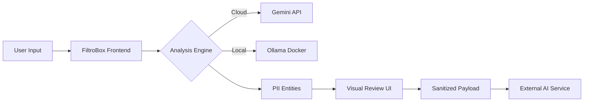

# 🛡️ FiltroBox12ai

> **The Privacy-First AI Filtering Platform**  
> *Sanitize sensitive data before it reaches external LLMs.*


**FiltroBox12ai** is a modern, aesthetic, and robust middleware platform designed to prevent data leakage. It acts as a secure gateway between your sensitive internal data and public AI services (like OpenAI, Claude, or Gemini). By analyzing, highlighting, and redacting Personally Identifiable Information (PII) locally or via a controlled environment, it ensures developers maintain full sovereignty over their data.

**Thank You JESUS**


---

## 🚀 Key Features

### 🔍 Deep PII Detection
- **Hybrid Analysis Engine**: Combines fast Regex pattern matching with context-aware AI models (Gemini Flash) to detect subtle PII like names, addresses, and proprietary project codes.
- **Smart Classification**: Automatically classifies input data (e.g., "Python Script", "Financial Report") and provides a content summary.

### ⚡ Flexible Processing Engines
- **Cloud Mode**: Utilizes **Google Gemini 2.5 Flash** for high-speed, low-latency analysis.
- **Local Mode (Docker/Ollama)**: *Ready-to-integrate* architecture for running open-source models (like Llama 3 or Mistral) completely offline within your VPC.

### 🛠️ Granular Control
- **Rule Configuration**: Create, edit, and toggle specific detection rules.
- **Custom Regex Builder**: Add organization-specific patterns (e.g., Internal Employee IDs) with a built-in **Live Regex Tester**.
- **Visual Redaction**: Interactive UI to approve or reject specific redactions before finalizing the payload.

### 📊 Analytics & Dashboard
- **Real-time Metrics**: Track how much sensitive data is being intercepted.
- **Threat Distribution**: Visualize the types of data (Emails, Credit Cards, API Keys) most frequently detected.

---

## 🏗️ Architecture

The application is built as a Single Page Application (SPA) using React 19.



### Tech Stack
- **Frontend**: React, TypeScript, Vite (assumed environment)
- **Styling**: Tailwind CSS (Dark Mode/Cyberpunk Aesthetic)
- **Icons**: Lucide React
- **Charts**: Recharts
- **AI Integration**: Google GenAI SDK

---

## 📦 Installation & Setup

### Prerequisites
- Node.js v18+
- A Google Gemini API Key

### 1. Clone the Repository
```bash
git clone https://github.com/your-org/filtrobox12ai.git
cd filtrobox12ai
```

### 2. Install Dependencies
```bash
npm install
```

### 3. Environment Configuration
Create a `.env` file in the root directory and add your API key.
```bash
API_KEY=your_google_gemini_api_key
```
*Note: The application expects `process.env.API_KEY` to be available. In a Vite environment, ensure the variable is exposed or configured in `vite.config.ts`.*

### 4. Run the Application
```bash
npm start
```
The app will launch at `http://localhost:8080` (or your configured port).

---

## 📖 Usage Guide

### 1. The Dashboard (Landing)
- **Paste or Upload**: Paste raw text (JSON, SQL, Code, Prose) or upload a text file.
- **Select Engine**: Toggle between Gemini (Cloud) or Ollama (Local) via the header.
- **Scan**: Click "Scan Payload" to begin analysis.

### 2. Analysis View
- **Highlight Mode**: Click on highlighted entities to toggle redaction on/off.
- **Output Preview**: Switch tabs to see exactly what the sanitized text looks like.
- **Approve**: Click "Approve & Send" to simulate forwarding the clean data to its destination.

### 3. Rule Configuration
- Navigate to **Filtering Rules**.
- Toggle standard rules (Credit Cards, SSN) on/off.
- Click **"New Rule"** to define a custom pattern:
  - *Name*: "Internal Project Code"
  - *Regex*: `PROJ-\d{4}`
  - *Test*: Use the embedded tester to verify it matches `PROJ-1234`.

---

## 🐳 Docker / Local Mode (Ollama)

To enable the local privacy engine, you would typically run an Ollama container alongside this frontend.

```bash
# Example Docker Command for the backend engine
docker run -d -v ollama:/root/.ollama -p 11434:11434 --name ollama ollama/ollama
```

*Note: The current frontend has a toggle for Ollama, but requires a local proxy or backend service to communicate with the Ollama API directly due to browser CORS policies.*

---

## 🛡️ Security Best Practices

1.  **API Keys**: Never commit your `.env` file.
2.  **Audit Logs**: Use the Settings page (mockup) to configure log retention policies.
3.  **Review First**: Always manually review high-sensitivity documents in the Analysis View before approving.

---

## 🤝 Contributing

Contributions are welcome! Please fork the repository and submit a pull request.

1.  Fork the Project
2.  Create your Feature Branch (`git checkout -b feature/AmazingFeature`)
3.  Commit your Changes (`git commit -m 'Add some AmazingFeature'`)
4.  Push to the Branch (`git push origin feature/AmazingFeature`)
5.  Open a Pull Request

---

## 📄 License

Distributed under the MIT License. See `LICENSE` for more information.
